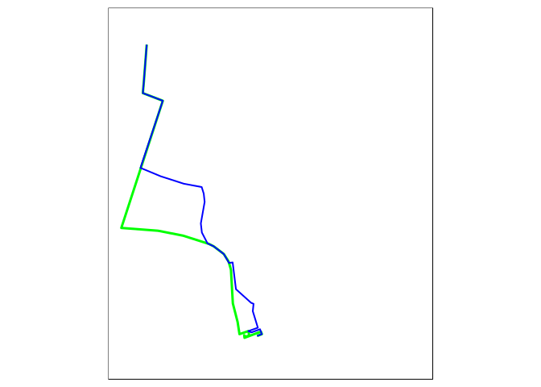
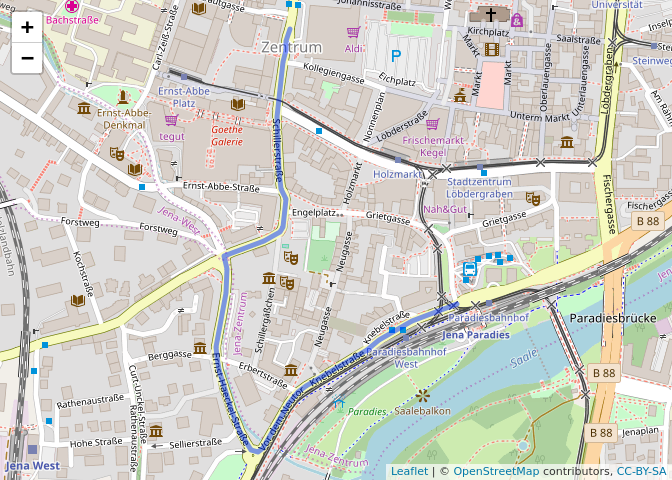

Routing services and local routing in R: a tutorial with stplanr and dodgr
================
Robin Lovelace
2018-04-10

Prerequisites
=============

This workshop is an extension of the transport chapter ([Chapter 7](http://geocompr.robinlovelace.net/transport.html)) in the book *Geocomputation with R* (Lovelace, Nowosad, and Muenchow 2018). This book is available at [geocompr.robinlovelace.net](http://geocompr.robinlovelace.net). Reading the chapter is not a prerequisite but it's recommended reading for context before you dive-into this tutorial. The book is description-heavy and code light. This tutorial is vice versa.

There are two ways to get the data that is part of this workshop:

-   Download and unzip the repo from GitHub via `git clone` or by clicking on [`Clone or download`](https://github.com/Robinlovelace/geocomp-tranport-workshop/archive/master.zip) on the [github.com/Robinlovelace/geocomp-tranport-workshop](https://github.com/Robinlovelace/geocomp-tranport-workshop) web page
-   Entering (or copy-pasting) the following commands in R

``` r
u = "https://github.com/Robinlovelace/geocomp-tranport-workshop/archive/master.zip"
download.file(u, "master.zip")
unzip("master.zip")
```

From there the easiest way to change working directory, and access the project's data, is by opening the [`geocomp-tranport-workshop.Rproj`](https://github.com/Robinlovelace/geocomp-tranport-workshop/blob/master/geocomp-tranport-workshop.Rproj) project file in RStudio.

The software prerequisites are an up-to-date R version and packages that can be loaded follows:

``` r
library(stplanr)
library(tmap)
library(sf)
#> Linking to GEOS 3.5.1, GDAL 2.2.2, proj.4 4.9.2
library(leaflet)
library(dodgr)
```

Introduction
============

As described in the `stplanr-paper` vignette (Lovelace and Ellison 2017) there are various approaches to routing available in the package. This vignette seeks to demonstrate these approaches using a case study in the town of Jena, Germany.

Online routing
==============

The simplest routing strategy is to use an online service such as the public facing OSRM demo routing service at <http://router.project-osrm.org/> with an interactive map-based GUI at <http://map.project-osrm.org/>.

We can demonstrate this routing service in action by planning a route from Jena Paradies rail station to Jen Tower, a building that is "the tallest in Eastern Germany" according to [Wikipedia](https://en.wikipedia.org/wiki/JenTower). This represents a typical journey that one may take on visiting the city for the first time:

``` r
from = "Jena Paradies"
to = "JenTower"
```

``` r
r_osrm = route_osrm(from, to)
saveRDS(r_osrm, "r_osrm.Rds")
```

What just happened? There were 3 main steps taken inside the function `route_osrm()`:

-   The origin and destination text strings were geo-coded
-   The information was sent to the OSRM server and returned
-   The data was converted into a form that can be used in R

In case this does not work on your computer (you need a recent version of stplanr) you can load it as follows:

``` r
r_osrm = readRDS("r_osrm.Rds")
```

The class of the resulting object can be queried as follows:

``` r
class(r_osrm)
#> [1] "SpatialLinesDataFrame"
#> attr(,"package")
#> [1] "sp"
```

We can verify that it contains the spatial information we need by plotting it interactively:

``` r
leaflet() %>% addTiles() %>% addPolylines(data = r_osrm)
```


We can execute the first step taken as follows:

``` r
(from_coords = geo_code(from))
#> [1] 11.58766 50.92493
(to_coords = geo_code(to))
#> [1] 11.58465 50.92883
```

We could continue to explore what happened in the function by executing the functions `viaroute()` and `viaroute2sldf()` sequentially but that is not the point of this vignette (see the source code for more information on the internals of `route_osrm` but be warned, they are not pretty)!

Other routing services can also be used, as illustrated by the `route_graphhopper()` call below:

``` r
r_graphbike = route_graphhopper(from_coords, to_coords)
saveRDS(r_graphbike, "r_graphbike.Rds")
```

Be warned: this code may not work on your computer because you need a graphhopper api key. We can check that we have one on this computer with the following command:

``` r
Sys.getenv("GRAPHHOPPER") %>% nchar()
#> [1] 36
```

If so you will have 32 characters, if not the result will have 0. (To get a Graphhopper API key see `?route_graphhopper`.) That is not a problem as I've saved the result, which can be loaded with:

``` r
r_graphbike = readRDS("r_graphbike.Rds")
```

The advantage of the Graphhopper API is that it has three routing profiles available (and many more with their paid plan), as illustrated below (the default is bike):

``` r
r_graphcar = route_graphhopper(from_coords, to_coords, vehicle = "car")
r_graphwalk = route_graphhopper(from_coords, to_coords, vehicle = "foot")
saveRDS(r_graphcar, "r_graphcar.Rds")
saveRDS(r_graphwalk, "r_graphwalk.Rds")
```

As before, these can be loaded from the repo as follows:

``` r
r_graphcar = readRDS("r_graphcar.Rds")
r_graphwalk = readRDS("r_graphwalk.Rds")
```

We can compare these different routes, as illustrated in the figures below:

``` r
b = tmaptools::bb(r_osrm, ext = 1.2)
tm_shape(r_osrm, bbox = b) +
  tm_lines(col = "red", lwd = 6) +
  qtm(r_graphcar, lines.col = "orange", lines.lwd = 4)
tm_shape(r_osrm, bbox = b) +
  tm_lines(col = "white", lwd = 6) +
  qtm(r_graphbike, lines.col = "green", lines.lwd = 3) +
  qtm(r_graphwalk, lines.col = "blue", lines.lwd = 2)
```


<p class="caption">
Routes for driving (left panel, with OSRM in red and Graphhopper in orange) and active transport (right panel, cycling in green, walking in blue).
</p>

The results show a diversity of route options. We can make the following generalisations:

-   Motorised routes tend to be more circuitous
-   Routes for the same mode can be very different depending on which weighting profile is used
-   Walking and cycling routes tend to be similar, although walking routes tend to be more direct as they can pass through steps etc.

There are some major limitations associated with online routing:

-   It is slow
-   It can be expensive
-   It's not conducive to reproducibility - the service may change and you need an API key
-   You do not have control over the weighting profiles (this can be good and bad)

To overcome these limitations we can do local routing.

Local routing
=============

To do local routing you need a route network, e.g. as provided by the following commands:

``` r
library(osmdata)
bb_jena = getbb("Jena")
osm_jena = opq(bbox = bb_jena) %>% 
  add_osm_feature("highway", "prim|second|cycle", value_exact = FALSE) %>% 
  osmdata_sf()
summary(osm_jena)
ways = osm_jena$osm_lines
write_sf(ways, "ways.geojson")
```

To save time we've saved the result, which can be loaded as follows from the vignettes folder:

``` r
ways = read_sf("ways.geojson")
```

Let's check if this is a reasonable representation of Jena's route network:

``` r
leaflet() %>% addTiles() %>% addPolylines(data = ways)
```


Clearly it's a very simplified route network. A more comprehensive network could be created by altering the arguments passed to `add_osm_feature`, e.g. to simply `add_osm_feature("highway")`. We deliberately use a subset of the network for teaching. Now, how do we find routes along it?

``` r
ways_sp = as(ways, "Spatial")
ways_sln = SpatialLinesNetwork(ways_sp)
slotNames(ways_sln)
#> [1] "sl"          "g"           "nb"          "weightfield"
weightfield(ways_sln)
#> [1] "length"
class(ways_sln@g)
#> [1] "igraph"
```

We can find the shortest path between A and B as follows:

``` r
from_sln = find_network_nodes(ways_sln, from_coords[1], from_coords[2])
to_sln = find_network_nodes(ways_sln, to_coords[1], to_coords[2])
r_local = sum_network_routes(ways_sln, from_sln, to_sln, "length", combinations = F)
leaflet() %>% addTiles() %>% addPolylines(data = r_local)
```



``` r
g = ways_sln@g
e = igraph::edge_betweenness(ways_sln@g)
lwd = e / mean(e)
plot(ways_sln@sl, lwd = lwd)
```


``` r
leaflet() %>% addProviderTiles("OpenStreetMap.BlackAndWhite") %>%
  addPolylines(data = ways_sln@sl, weight = lwd * 5)
```


What has just happened? Well this is a workshop that aims to teach how to learn so this is a question for you to answer. Here are some clues:

-   `?igraph::edge_betweenness`
-   Google "graph betweenness"
-   Take a look at the paper Cooper (2017)
-   Ask the sub-question: how does this relate to routing single lines above?

Anothe way to acheive a similar result is with the **dodgr** package:

``` r
ways_dg = weight_streetnet(ways)
summary(ways_dg)
#>     geom_num         edge_id        from_id             from_lon    
#>  Min.   :   1.0   Min.   :    1   Length:18170       Min.   :11.41  
#>  1st Qu.: 339.0   1st Qu.: 4543   Class :character   1st Qu.:11.54  
#>  Median : 652.0   Median : 9086   Mode  :character   Median :11.60  
#>  Mean   : 706.4   Mean   : 9086                      Mean   :11.60  
#>  3rd Qu.:1062.0   3rd Qu.:13628                      3rd Qu.:11.68  
#>  Max.   :1561.0   Max.   :18170                      Max.   :11.77  
#>     from_lat        to_id               to_lon          to_lat     
#>  Min.   :50.76   Length:18170       Min.   :11.41   Min.   :50.76  
#>  1st Qu.:50.87   Class :character   1st Qu.:11.54   1st Qu.:50.87  
#>  Median :50.93   Mode  :character   Median :11.60   Median :50.93  
#>  Mean   :50.93                      Mean   :11.60   Mean   :50.93  
#>  3rd Qu.:51.01                      3rd Qu.:11.68   3rd Qu.:51.01  
#>  Max.   :51.11                      Max.   :11.77   Max.   :51.11  
#>        d              d_weighted          highway         
#>  Min.   :0.000557   Min.   :    0.001   Length:18170      
#>  1st Qu.:0.014026   1st Qu.:    0.018   Class :character  
#>  Median :0.024300   Median :    0.031   Mode  :character  
#>  Mean   :0.039564   Mean   :   27.618                     
#>  3rd Qu.:0.045741   3rd Qu.:    0.061                     
#>  Max.   :0.890253   Max.   :10734.315                     
#>     way_id            component     
#>  Length:18170       Min.   : 1.000  
#>  Class :character   1st Qu.: 1.000  
#>  Mode  :character   Median : 1.000  
#>                     Mean   : 2.511  
#>                     3rd Qu.: 1.000  
#>                     Max.   :43.000
```

This shows that there are 18,000+ edges just in that subset of ways in a small town. This should explain why we're not using the complete route network!

In any case, we can find the fastest route between any 2 'node' points on the graph as follows:

``` r
verts <- dodgr_vertices(ways_dg) # the vertices or points for routing
# path between 2 arbitrarily chosen vertices:
dp = dodgr_paths(ways_dg, from = verts$id [1], to = verts$id [9000])
str(dp)
#> List of 1
#>  $ 1:List of 1
#>   ..$ 1-9000: chr [1:335] "45" "46" "47" "501" ...
```

The result is a character vector of IDs representing the shortest path, with values mapping on to `verts$id`. These can be joined together into a spatial object with:

``` r
path1 <- verts[match(dp[[1]][[1]], verts$id), ]
head(path1)
#>      id        x        y component   n
#> 67   45 11.58296 50.92303         1  44
#> 68   46 11.58299 50.92306         1  45
#> 69   47 11.58300 50.92310         1  46
#> 833 501 11.58298 50.92314         1 500
#> 831 500 11.58308 50.92319         1 499
#> 829 499 11.58348 50.92363         1 498
```

The path can be visualised as follows:

``` r
leaflet() %>% addTiles() %>% addCircles(path1$x, path1$y)
```


How can we convert this into a spatial network again? To do so we can do routing on an industrial scale, using the bicycle weighting profile as follows:

``` r
from <- sample(ways_dg$from_id, size = 100)
to <- sample(ways_dg$to_id, size = 100)
flows <- matrix(rep(1, length(from) * length(to)),
                 nrow = length(from))
graph_f <- dodgr_flows_aggregate(ways_dg, from, to, flows = flows,
                                 wt_profile = "bicycle")
head(graph_f)
#>   geom_num edge_id from_id from_lon from_lat to_id   to_lon   to_lat
#> 1        1       1       1 11.58286 50.92301     2 11.58280 50.92285
#> 2        1       2       2 11.58280 50.92285     1 11.58286 50.92301
#> 3        1       3       2 11.58280 50.92285     3 11.58137 50.92114
#> 4        1       4       3 11.58137 50.92114     2 11.58280 50.92285
#> 5        1       5       3 11.58137 50.92114     4 11.58129 50.92105
#> 6        1       6       4 11.58129 50.92105     3 11.58137 50.92114
#>            d d_weighted   highway  way_id component flow
#> 1 0.01764792 0.02205990 secondary 4934236         1  361
#> 2 0.01764792 0.02205990 secondary 4934236         1  340
#> 3 0.21501921 0.26877401 secondary 4934236         1  361
#> 4 0.21501921 0.26877401 secondary 4934236         1  340
#> 5 0.01215404 0.01519255 secondary 4934236         1  361
#> 6 0.01215404 0.01519255 secondary 4934236         1  340
```

The above code created a origin-destination dataset with 100 origins and 100 destinations and found the shortest path, for the bicycle road weight profile, of the 10,000 routes between them. Imagine how long all that routing would take using an on-line routing service. The code chunk below converts the results back into a spatial object, and plots it:

``` r
graph_undir <- merge_directed_flows (graph_f)
ways_dsf = dodgr_to_sf(net = graph_undir)
names(ways_dsf$dat)
#> [1] "geom_num"  "highway"   "way_id"    "component" "flow"
names(ways_dsf)
#> [1] "dat"   "geoms"
lwd2 = ways_dsf$dat$flow / mean(ways_dsf$dat$flow)
plot(ways_dsf$geoms, lwd = lwd2)
```


Questions for further study:

-   How does **dodgr** work?
    -   Hint: see the [`dodgr` vignette](https://cran.r-project.org/web/packages/dodgr/vignettes/dodgr.html#6_shortest_paths) (Padgham and Peutschnig, n.d.)
-   How can more realistic flows between origin-destination pairs be generated?
    -   Hint: see Simini et al. (2012).

Acknowledgements
================

Many thanks to the developers of all the software used in this tutorial and Jannes Muenchow for hosting me in Jena.

For reproducibility, the package versions used for this tutorial are shown below (note the development versions are used in many cases):

``` r
devtools::session_info()
#> Session info -------------------------------------------------------------
#>  setting  value                       
#>  version  R version 3.4.4 (2018-03-15)
#>  system   x86_64, linux-gnu           
#>  ui       X11                         
#>  language en_GB:en                    
#>  collate  en_GB.UTF-8                 
#>  tz       Europe/London               
#>  date     2018-04-10
#> Packages -----------------------------------------------------------------
#>  package      * version    date       source                              
#>  assertthat     0.2.0      2017-04-11 cran (@0.2.0)                       
#>  backports      1.1.2      2017-12-13 CRAN (R 3.4.3)                      
#>  base         * 3.4.4      2018-03-16 local                               
#>  base64enc      0.1-3      2015-07-28 cran (@0.1-3)                       
#>  bindr          0.1.1      2018-03-13 CRAN (R 3.4.4)                      
#>  bindrcpp       0.2.2      2018-03-29 CRAN (R 3.4.4)                      
#>  bitops         1.0-6      2013-08-17 CRAN (R 3.4.1)                      
#>  boot           1.3-20     2017-07-30 CRAN (R 3.4.1)                      
#>  class          7.3-14     2015-08-30 CRAN (R 3.4.0)                      
#>  classInt       0.1-24     2017-04-16 cran (@0.1-24)                      
#>  coda           0.19-1     2016-12-08 cran (@0.19-1)                      
#>  codetools      0.2-15     2016-10-05 CRAN (R 3.3.1)                      
#>  colorspace     1.3-2      2016-12-14 CRAN (R 3.4.1)                      
#>  compiler       3.4.4      2018-03-16 local                               
#>  crosstalk      1.0.0      2016-12-21 cran (@1.0.0)                       
#>  curl           3.2        2018-03-28 CRAN (R 3.4.4)                      
#>  datasets     * 3.4.4      2018-03-16 local                               
#>  DBI            0.8        2018-03-02 cran (@0.8)                         
#>  deldir         0.1-15     2018-04-01 CRAN (R 3.4.4)                      
#>  devtools       1.13.5     2018-02-18 CRAN (R 3.4.4)                      
#>  dichromat      2.0-0      2013-01-24 CRAN (R 3.3.2)                      
#>  digest         0.6.15     2018-01-28 CRAN (R 3.4.3)                      
#>  dodgr        * 0.1.0.099  2018-04-10 Github (ATFutures/dodgr@94bbb8a)    
#>  dplyr          0.7.4      2017-09-28 CRAN (R 3.4.3)                      
#>  e1071          1.6-8      2017-02-02 cran (@1.6-8)                       
#>  evaluate       0.10.1     2017-06-24 CRAN (R 3.4.1)                      
#>  expm           0.999-2    2017-03-29 cran (@0.999-2)                     
#>  foreach        1.4.4      2017-12-12 CRAN (R 3.4.3)                      
#>  foreign        0.8-69     2017-06-21 CRAN (R 3.4.0)                      
#>  gdalUtils      2.0.1.7    2015-10-10 cran (@2.0.1.7)                     
#>  gdata          2.18.0     2017-06-06 cran (@2.18.0)                      
#>  geojsonlint    0.2.0      2016-11-03 cran (@0.2.0)                       
#>  geosphere      1.5-7      2017-11-05 CRAN (R 3.4.2)                      
#>  glue           1.2.0      2017-10-29 CRAN (R 3.4.2)                      
#>  gmodels        2.16.2     2015-07-22 cran (@2.16.2)                      
#>  graphics     * 3.4.4      2018-03-16 local                               
#>  grDevices    * 3.4.4      2018-03-16 local                               
#>  grid           3.4.4      2018-03-16 local                               
#>  gtools         3.5.0      2015-05-29 cran (@3.5.0)                       
#>  highr          0.6        2016-05-09 CRAN (R 3.3.2)                      
#>  htmltools      0.3.6      2017-04-28 cran (@0.3.6)                       
#>  htmlwidgets    1.0        2018-01-20 CRAN (R 3.4.3)                      
#>  httpuv         1.3.6.2    2018-03-02 CRAN (R 3.4.4)                      
#>  httr           1.3.1      2017-08-20 cran (@1.3.1)                       
#>  igraph         1.2.1      2018-03-10 cran (@1.2.1)                       
#>  iterators      1.0.9      2017-12-12 CRAN (R 3.4.3)                      
#>  jsonlite       1.5        2017-06-01 cran (@1.5)                         
#>  jsonvalidate   1.0.0      2016-06-13 cran (@1.0.0)                       
#>  KernSmooth     2.23-15    2015-06-29 CRAN (R 3.4.0)                      
#>  knitr          1.20       2018-02-20 cran (@1.20)                        
#>  lattice        0.20-35    2017-03-25 CRAN (R 3.3.3)                      
#>  leaflet      * 2.0.0      2018-04-09 Github (rstudio/leaflet@8d54fd4)    
#>  LearnBayes     2.15.1     2018-03-18 CRAN (R 3.4.4)                      
#>  lubridate      1.7.3      2018-02-27 cran (@1.7.3)                       
#>  lwgeom         0.1-5      2018-03-20 Github (r-spatial/lwgeom@389090c)   
#>  magrittr       1.5        2014-11-22 CRAN (R 3.3.2)                      
#>  maptools       0.9-2      2017-03-25 cran (@0.9-2)                       
#>  mapview        2.3.0      2018-01-30 cran (@2.3.0)                       
#>  MASS           7.3-49     2018-02-23 CRAN (R 3.4.3)                      
#>  Matrix         1.2-13     2018-04-02 CRAN (R 3.4.4)                      
#>  memoise        1.1.0      2017-04-21 CRAN (R 3.4.1)                      
#>  methods      * 3.4.4      2018-03-16 local                               
#>  mime           0.5        2016-07-07 CRAN (R 3.3.2)                      
#>  munsell        0.4.3      2016-02-13 CRAN (R 3.3.2)                      
#>  nlme           3.1-131.1  2018-02-16 CRAN (R 3.4.3)                      
#>  openxlsx       4.0.17     2017-03-23 CRAN (R 3.4.1)                      
#>  osmar          1.1-7      2013-11-21 cran (@1.1-7)                       
#>  osmdata        0.0.6.001  2018-03-20 Github (ropensci/osmdata@367a29c)   
#>  pillar         1.2.1      2018-02-27 CRAN (R 3.4.4)                      
#>  pkgconfig      2.0.1      2017-03-21 cran (@2.0.1)                       
#>  plyr           1.8.4      2016-06-08 CRAN (R 3.3.2)                      
#>  png            0.1-7      2013-12-03 cran (@0.1-7)                       
#>  R.methodsS3    1.7.1      2016-02-16 cran (@1.7.1)                       
#>  R.oo           1.21.0     2016-11-01 cran (@1.21.0)                      
#>  R.utils        2.6.0      2017-11-05 CRAN (R 3.4.2)                      
#>  R6             2.2.2      2017-06-17 cran (@2.2.2)                       
#>  raster         2.6-7      2017-11-13 CRAN (R 3.4.2)                      
#>  rbenchmark     1.0.0      2012-08-30 CRAN (R 3.4.3)                      
#>  RColorBrewer   1.1-2      2014-12-07 CRAN (R 3.3.2)                      
#>  Rcpp           0.12.16    2018-03-13 CRAN (R 3.4.4)                      
#>  RcppParallel   4.4.0      2018-03-02 CRAN (R 3.4.4)                      
#>  RCurl          1.95-4.10  2018-01-04 CRAN (R 3.4.3)                      
#>  rgdal          1.2-18     2018-03-17 CRAN (R 3.4.4)                      
#>  rgeos          0.3-26     2017-10-31 cran (@0.3-26)                      
#>  rlang          0.2.0.9001 2018-04-10 Github (r-lib/rlang@70d2d40)        
#>  rmapshaper     0.4.0      2018-04-05 Github (ateucher/rmapshaper@c3895d3)
#>  rmarkdown      1.9        2018-03-01 CRAN (R 3.4.4)                      
#>  rprojroot      1.3-2      2018-01-03 CRAN (R 3.4.3)                      
#>  rvest          0.3.2      2016-06-17 CRAN (R 3.3.2)                      
#>  satellite      1.0.1      2017-10-18 CRAN (R 3.4.2)                      
#>  scales         0.5.0.9000 2017-11-06 Github (hadley/scales@d767915)      
#>  sf           * 0.6-2      2018-04-09 Github (r-spatial/sf@b7de234)       
#>  shiny          1.0.5      2017-08-23 CRAN (R 3.4.1)                      
#>  sp             1.2-7      2018-01-19 cran (@1.2-7)                       
#>  spData         0.2.8.4    2018-04-03 Github (nowosad/spData@028447b)     
#>  spDataLarge    0.2.6.1    2018-04-03 Github (nowosad/spDataLarge@1ff264f)
#>  spdep          0.7-7      2018-04-03 CRAN (R 3.4.4)                      
#>  splines        3.4.4      2018-03-16 local                               
#>  stats        * 3.4.4      2018-03-16 local                               
#>  stats4         3.4.4      2018-03-16 local                               
#>  stplanr      * 0.2.3.9000 2018-04-10 Github (ropensci/stplanr@4b8abda)   
#>  stringi        1.1.7      2018-03-12 CRAN (R 3.4.4)                      
#>  stringr        1.3.0      2018-02-19 cran (@1.3.0)                       
#>  tibble         1.4.2      2018-01-22 cran (@1.4.2)                       
#>  tmap         * 2.0        2018-04-09 Github (mtennekes/tmap@32ab9d9)     
#>  tmaptools      2.0        2018-04-07 Github (mtennekes/tmaptools@01d1e9f)
#>  tools          3.4.4      2018-03-16 local                               
#>  udunits2       0.13       2016-11-17 cran (@0.13)                        
#>  units          0.5-1      2018-01-08 cran (@0.5-1)                       
#>  utils        * 3.4.4      2018-03-16 local                               
#>  V8             1.5        2017-04-25 cran (@1.5)                         
#>  viridisLite    0.3.0      2018-02-01 cran (@0.3.0)                       
#>  webshot        0.5.0      2017-11-29 CRAN (R 3.4.2)                      
#>  withr          2.1.2      2018-04-07 Github (jimhester/withr@79d7b0d)    
#>  XML            3.98-1.10  2018-02-19 cran (@3.98-1.)                     
#>  xml2           1.2.0      2018-01-24 CRAN (R 3.4.3)                      
#>  xtable         1.8-2      2016-02-05 cran (@1.8-2)                       
#>  yaml           2.1.18     2018-03-08 CRAN (R 3.4.4)
```

References
==========

Cooper, Crispin H.V. 2017. “Using Spatial Network Analysis to Model Pedal Cycle Flows, Risk and Mode Choice.” *Journal of Transport Geography* 58 (January): 157–65. doi:[10.1016/j.jtrangeo.2016.12.003](https://doi.org/10.1016/j.jtrangeo.2016.12.003).

Lovelace, Robin, and Richard Ellison. 2017. “Stplanr: A Package for Transport Planning.” *The R Journal*. <https://github.com/ropensci/stplanr>.

Lovelace, Robin, Jakub Nowosad, and Jannes Muenchow. 2018. *Geocomputation with R*.

Padgham, Mark, and Andreas Peutschnig. n.d. *Dodgr: Distances on Directed Graphs*. <https://github.com/ATFutures/dodgr>.

Simini, Filippo, Marta C Gonz’alez, Amos Maritan, and Albert-L’aszl’o Barab’asi. 2012. “A Universal Model for Mobility and Migration Patterns.” *Nature*, February, 8–12. doi:[10.1038/nature10856](https://doi.org/10.1038/nature10856).
